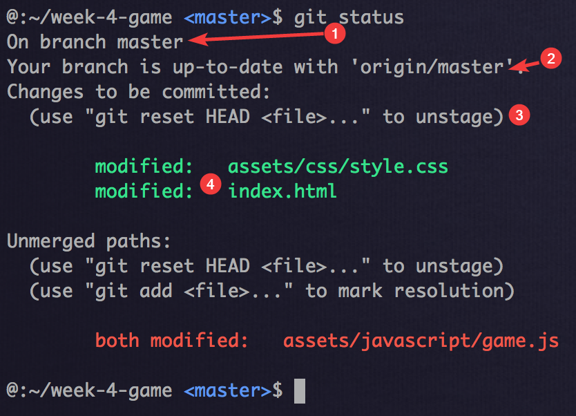
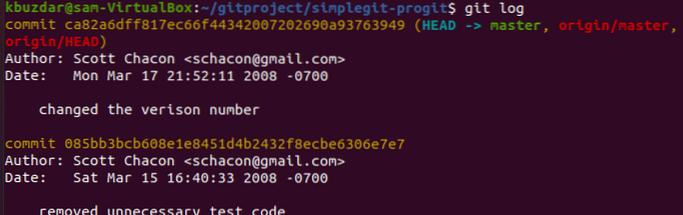

# Programacion orientada a objetos (POO)

Es un paradigma de programacion con lenguaje descriptivo y funcional, cercano al mundo real. En este metodo de programacion el codigo se organiza unidades llamadas **clases ** (como tu molde), de las cuales se crean **objetos** que contienen su datos en forma de atributos y sus funcionalidades (o procesos) en forma de metodos, los objetos los relacionanamos entre si para consegir las funcionalidades que requerimos de nuestras aplicaciones.

Fue creada con el los proposito de resolver limitaciones y problemas de la programacion estructurada, agregando:

- [x] Poder escalar el projectos grandes con mayor facilidad.

- [x] Resolver la division que habia entre la programacion orientada a los procesos (aqui resuelto siendo metodos) y la programacion orientada a los datos (aqui siendo atributos).
- [x] Facilitar la reutilizacion de codigo, lo que llevo a la posibilidad de creacion de bibliotecas, y poder usar bibliotecas de terceros con facilidad, lo que evita la repeticion de codigo.

La programacion orientada a objetos tiene 4 pilares fundamentales: *Abstracion, Herencia, Polimorfismo y Encapsulamiento*. Los cuales ampliaremos a continuacion.

## **Abstracion**: 

Se trata de aislar una pieza de codigo del resto de su contexto y otras piezas de codigo que  la acompañan, para enfocarse unicamente en ¿que es lo que hace?, en vez de ¿como lo hace?.

En especifico, las abstracciones dentro de la programacion orientada a objetos son las caracteristicas especificas de un objeto, las cuales lo distinguen de los demas tipos de objetos, a la ves que marca limites conceptuales. Un ejemplo sencillo seria:

```javascript
//codigo JavaScript
class Humano {

  constructor(edad, alimentarlo) {
    this.edad = edad;
    this.alimentarlo = alimentarlo;
  }

    darComida() {
    alimentarlo.comida(this.edad);
    /* Qué es lo que hace el alimentarlo? ps ni idea. Y no me importa.
     Me importa que lo hace, el resultado que meda, no el CÓMO lo hace.
     Yo solo sé que le paso la edad a ese método y el ser vivo se alimenta 
     correctamente!.
      Es un ejemplo claro de abstraccion. Sabemos lo que necesitamos darle,
     y lo que recibimos de el, pero el funcionamiento interno no es de importancia. 
      Es decir, abstraemos al programador de todo el  funcionamiento del método, 
     y el solo se concentrara en  arreglar/hacer lo que necesite sin tener idea de lo demas*/
  }
}
```


## Herencia:

Es una mecanica de POO que como hemos hablado se basa en clases, la cual equivale a un molde, y con la herencia podemos extender su funcionalidad a otras clases. Comunmente se le llama Clase padre (con sus atributos y metodos "genericos"), clase de la cual se esta heredando, y clase hija la que esta recibiendo los atributos y metodos de la clase padre, la cual tendra los comportamientos de la clase padre, como si hubieran sido escrito dentro de si misma, y apartir de alli extender su funcionalidad, modificarla, o ambas, aqui el potencial de reutilizacion de codigo de la programacion Orientada a objetos. En sintesis: **Herencia = Copy paste**.

```kotlin
//Kotlin

//colocamos open para permitir extender clases hijas desde esta clase padre
open class Student {
  
  // la funcion es open para poder ser moficada 
  open fun schoolFees(): BigDecimal {
    // do implementation
  }
}

open class GraduateStudent : Student() {
 
    // override modificando la funcion de schoolFees() en Student(), 
    // con override queda "open" de forma predeterminada para
    // cuando otra clase la exitienda
    override fun schoolFees(): BigDecimal {
        return super.schoolFees() + calculateSchoolFees()
    }
 
    private fun calculateSchoolFees(): BigDecimal {
        // calculate and return school fees
    }
}

```


## Polimorfismo :

Partiendo de descomponer el termino, tenemos **Poli** = Muchos, y **Morfismo** = forma | estructura de un cuerpo. Es la capacidad que tienen los objetos de una clase de responder a los mismos mensajes o eventos (es decir al invocar el mismo metodo) desde distintas clases, y que cada una de esas clases pueda responder a ese mensaje de forma distinta. Esto se logra modificando los metodos y agregar atributos en la clase hija, cosas que previamente habias heredado de la clase padre. En sintesis: **Polimorfismo = modificar el Copy Paste**, sintactimente, claro.

**Primero creamos una clase padre:**

```kotlin
abstract class serVivo(var name: String) {
    // aqui definimos las acciones de la clase
    abstract fun darCamisa()
}
```

**Creamos dos subclases:**

Hombre

```kotlin
// Hombre
class hombre(name:String) :serVivo(name){
    // reescribe el método de dar camisa
    override fun darCamisa() {
        println("${name} viste esta camisa azul.")
    }
}
```

Mujeres

```kotlin
// Mujer
class mujer(name:String) :serVivo(name) {
    // reescribe el método de dar camisa
    override fun darCamisa() {
        println("${name} viste esta camisa rosa.")
    }
}
```


## Encapsulamiento:

Es ocultar los datos miembros de un objeto, definiendo las permisos y formas de acceso a los metodos y atributos que pertenecen a una clase, para que solo puedan ser accedidas y cambiadas por la forma definida dentro del objeto.

Existen tres principales modificadores de acceso, que son:

Public: en este caso, todas las clases de afuera y las de afuera del paquete tendran acceso. cuando implementamos una clase por defecto todas las propiedades y métodos son de tipo public.

Protected: solo las clases del paquete pueden tener aceso.

Private: solo la clase principal tendra permitido el acceso.

```kotlin
class cocina {
    // tiempos de coccion (min)
    var arroz : Int = 25
    var pollo : Int = 35
    var tajada : Int = 5
    // las variables anteriores no tienen modificadores de acceso,
    // por lo que por defecto son Public (todos acceden y modifican)

    // metodos para cocinar
    fun Arroz() {
        if ( arroz > 24 ) {
            println("El arroz se cocino durante ${arroz} minutos o un poco mas, quedo bueno.")
        } else if (arroz > 35){
            println("El arroz se te quemo, botalo e intentalo de nuevo.")
        } else {
            println("El arroz aun esta crudo, dejalo mas tiempo")
        }
    }

    fun Pollo() {
        println("El pollo se cocino durante ${pollo} minutos, esta bien.")
    }

    fun Tajada() {
        println("La tajada se cocino y se volteo durante ${tajada} minutos, esta dorada")
    }
}

fun main() {
    val cocinarDeInmediato = cocina()

    // en ocaciones no queremos que se nos cambie el valor de nuetras variables
    // aqui no queda comestible ni el pegado
    cocinarDeInmediato.arroz = 50

    // cocinamos el arroz
    cocinarDeInmediato.Arroz() // El arroz se te quemo, botalo e intentalo de nuevo.
}
```

Usando los modificadores de acceso (encapsulamiento) evitamos que cambie, probemos:

```kotlin
class cocina {
    // tiempos de coccion (min)
    private var arroz : Int = 25
    private var pollo : Int = 35
    private var tajada : Int = 5
    // con private solo podemos acceder y modificar
    // desde este mismo objeto

    // metodos para cocinar
    fun Arroz() {
        if ( arroz > 24 ) {
            println("El arroz se cocino durante ${arroz} minutos o un poco mas, quedo bueno.")
        } 
        /*
        ...
        */
    }
    /*
    ...
    */
}

fun main() {
    val cocinarDeInmediato = cocina()

    // arroz, por estar privado, arrojara una excepsion y no dejara compilar
    cocinarDeInmediato.arroz = 60 //Cannot access 'arroz': it is private in 'cocina'

    // cocinamos el arroz
    cocinarDeInmediato.Arroz()
}
```

Te diras, ok, ya nadie profanara mi codigo del olimpo, pero... ¿y si es necesario que en casos especificos acceder a ellos o modificarlos? : Para eso existen los **Getters** y los **Setters**.

Los metodos getters son usados para obtener el valor de un atributo, y los setters para fijarles valores:

```kotlin
class cocina {
    // tiempos de coccion (min)
    private var arroz : Int = 25
    private var pollo : Int = 35
    private var tajada : Int = 5
    // con private solo podemos acceder y modificar
    // desde este mismo objeto

    // meollo
    fun setArroz ( arroz : Int){
        this.arroz = arroz
        // y la logica que necesitemos
    }
    fun getArroz(): Int {
        return arroz
    }

    // metodos para cocinar
    fun Arroz() {
        if ( arroz > 24 ) {
            println("El arroz se cocino durante ${arroz} minutos o un poco mas, quedo bueno.")
        }
        /*
        ...
        */
    }
    /*
    ...
    */
}

fun main() {
    val cocinarDeInmediato = cocina()

    // cambiamos el valor con el metodo set
    cocinarDeInmediato.setArroz(26)

    // si necesitaramos el valor de arroz
    // cocinarDeInmediato.getArroz()

    // cocinamos el arroz
    cocinarDeInmediato.Arroz()
}
```

# SOLID:

Es un acronimo (en ingles) que se basa en los 5 principios basicos de la programacion orientada a objetos, con la intencion de conseguir codigo limpio, por lo que no es necesario refactorizar, y a la vez que sea mas facil de mantener.

Estos 5 principios son:

## S – Single Responsibility Principle (SRP)

Este principio establece que una clase debe tener una sola responsabilidad, sin complejidades, que sea concreta, con el fin de hacer el codigo sencillo al evitar que hayan clases que cumplan con multiples funciones, lo que a veces es dificil recordar, y resulta en retrasos al revisar continuamente la clase para revisar que hace x cosa. 

## O – Open/Closed Principle (OCP)

Este afirma que cada parte del software debe ser cerrado para la modificacion, pero que debe estar abierto para poder extender funcionalidades.

## L – Liskov Substitution Principle (LSP)

Este establece que al estar usando una clase, y esta clase esta siendo extendida, debe ser posible usar cualquiera de las clases hijas sin que lanze un excepsion.

## I – Interface Segregation Principle (ISP)

...

## D – Dependency Inversion Principle (DIP)

...

# Paradigma Funcional:

...


# Git:

Esta herramienta fue desarrollada por Linus Torvadls y su funcion es tener control de las versiones del codigo de forma distribuida. Parte de los comandos usados son:

**`git clone`** - Se usa para descargarte a tu ordenador la ultima version del codigo fuente de un repositorio remoto (gitlab / github) , puede descargarse a trvestraves del metodo SSH o HTTPS

```
git clone <https://el-link--con-nombre-del-repositorio>
```

**`git branch`** - Las ramas son de lo mas importante en el mundo de git, con ellas varios desarrolladores pueden trabajar al mismo tiempo sin que hayan conflictos o superposiciones a la hora de  modificar el codigo, con este comando puedes listarlas, crearlas o eliminarlas a nivel local.

```
//  creando una nueva rama
git branch <tu-rama-para-trabajar>

// visualizar ramas
git branch
git branch --list

// borrar rama
git branch -d <nombre-de-la-rama-a eliminar>
```


**`git checkout`** - Este comando sirve para cambiarte de rama de trabajo, una ves creada la rama para posicionarse en ella se debe hacer con este comando.

```
git checkout <nombre-de-la-rama-donde-quieres-trabajar>

// puedes puedes resumir crear rama (en local) y cambiarte a esa rama
// a traves del comando:
git checkout -b <nombre-de-tu-rama-a-crear-y-posicionarte>
// (el -b viene de rama (branch)) 
```


**`git status`** - Nos da toda la infromacion del estado actual de la rama que estamos trabajando, detalles numerados en la imagen:

1. La rama en la que estamos posicionados.

2. Si hay cambios para confirmar, enviar o recibir (*pull*).

3. Si hay archivos que ya estan en preparación (*staged*), sin preparación (*unstaged*) o archivos que no están recibiendo seguimiento (*untracked*).

4. Si hay archivos creados, modificados o eliminados.

   


**`git add`** - Al realizar cambios en nuestra rama, estos cambios suceden en local pero aun no son incluidas para el siguiente commit, con este comando podemos incluir los cambios del archivo o de los archivos para el siguiente commit:

```
// añadir un archivo en especifico
git add <tu-archivo>

// agregar todo
git add -A

// agregar todo lo de la carpeta donde estas actualmente
git add .
```


**`git commit`** - Habiendo avanzado en las mejoras y correciones del codigo llegara el punto en el que queremos guardar los cambios (generalmente cuando una mejora esta completada o un bug resuelto), y asi establesces un punto de control para cuando quieras continuar nuevamente, el comando va a acompañado con un mesaje descriptivo en comillas para explicar que se ha modificado dentro del margen de ese commit.}

```
git commit -m "la descripcion de tu commit"
```


**`git push`** - Ya tenemos los comandos para trabajar las ramas a nivel local, despues de haber confirmado los cambios, necesitamos enviar la nueva rama al repositorio remoto, necesitarás usar el siguiente comando:

```
git push <nombre-remoto> <nombre-de-rama-a-subir>

// si su rama es nueva, pude que tengas que
// cargar y subir tu rama con el siguiente comando
git push --set-upstream <nombre-remoto> <nombre-de-tu-rama-reciente>
// o su atajo
git push -u origin <nombre-de-tu-rama-reciente>
```

Ten en cuenta que `git push` solo carga los archivos que han sido confirmados (con `git commit`).


**`git pull`** - Utilisamos este comando para recibir actualizaciones del repositirio remoto. Este comando fusiona las funcionalidades de los comandos `git fetch` y `git merge`, lo que quiere decir que al usar `git pull`, jalaremos las actualizaciones del repositorio remoto (`git fetch`) y de inmediato aplicamos esos ultimos cambios en local ( `git merge` )

```
git pull <nombre-remoto>
```

Recuerda, este comando puede generar conflictos que tendremos que resolver nosotros mismos.


**`git revert`** - En ocaciones hacemos commit/push a codigo con ciertos errores que queremos corregir, hay varios comando para deshacer cambios en local o remoto, estos comandos hay que tratarlos con cuidado, pausadamente, porque queriendo corregir algo podemos cometer error encima de error. Es necesario primero revisar el historial de commits, lo hacemos con el comando `git log` y veras un listado detallado asi:



Ya visto el historial usamos el numero (alfanum) del commit que queremos revertir:

```
git revert <tu-commit-a-revertir>
```

Una ventaja de usar git revert es que lo soluciona creando un nuevo revertiendo el anterior. 


**`git merge`** - Por ultimo y no menos imortante, cuando ya hayas completado tu parte del projecto, y pulido todos los detalles, asegurandote de que todo funcione correctamente, el ultimo paso es fusionar la rama que desarrollaste con su rama padre (`master` en este projecto), 

El paso a paso es:

**1) Debes pasarte a la rama `master` (o tu rama principal):**

```
git checkout master
```

**2) Antes de fusionarla, debes actualizar tu rama `master` local:**

```
git fetch
```

**3) Ahora si, puedes fusionar las caracteristicas de tu rama con la rama `master`:**

```
git merge <nombre-de-la-rama-a-fusionar>
```

Asegurate de que tu rama master tenga la ultima version (paso 1 y 2) antes de fusionar la rama, sino te presentara conflictos y cosas que no esperabas.